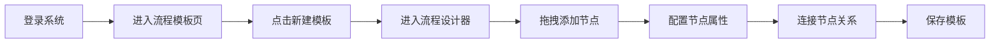
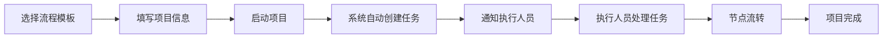
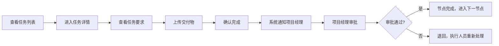

## 1. 产品概述

本产品是面向活动策划公司的工作流编排 Web 应用，用于配置从客户询价到活动结案的全流程协作管理。系统帮助企业标准化业务流程，明确各节点责任，追踪项目进度，处理异常情况，并提供数据报表支持决策。

- **核心价值**：将活动策划的复杂流程标准化、可视化，提升团队协作效率，降低项目延期风险
- **目标用户**：系统管理员、项目经理、执行人员

## 2. 核心特性

### 2.1 用户角色

| 角色 | 注册方式 | 核心权限 |
|------|----------|----------|
| 系统管理员 | 系统预设 | 创建/编辑流程模板、配置节点属性、管理用户权限、查看所有报表 |
| 项目经理 | 管理员创建 | 从模板发起项目、查看项目进度、催办逾期任务、上传交付物、退回不合格内容 |
| 执行人员 | 管理员创建 | 查看分配的任务、确认任务完成、上传交付物、留言沟通 |

### 2.2 功能模块

1. **流程模板管理**：模板列表、创建模板、编辑模板、删除模板
2. **流程设计器**：可视化拖拽节点、配置节点属性（负责人、截止时间、前置条件、必填材料、审批方式）
3. **执行中心**：项目列表、项目详情、节点状态追踪、催办功能、交付物管理
4. **任务中心**：个人任务列表、任务详情、确认完成、留言反馈
5. **异常处理**：异常记录列表、新增异常、变更原因、影响范围、补救动作
6. **报表统计**：项目耗时统计、延期节点分析、人员负载统计

### 2.3 页面详情

| 页面名称 | 模块名称 | 功能描述 |
|---------|----------|----------|
| 流程模板 | 模板列表 | 展示所有流程模板，支持搜索、筛选、新建 |
| 流程模板 | 模板详情 | 查看模板信息，编辑或启动项目 |
| 流程设计器 | 画布区域 | 可视化拖拽节点，连接节点关系 |
| 流程设计器 | 属性配置 | 配置节点的负责人、截止时间、前置条件、必填材料、审批方式 |
| 执行中心 | 项目列表 | 展示所有项目，支持按状态、时间筛选 |
| 执行中心 | 项目详情 | 展示项目流程图、各节点状态、操作按钮 |
| 任务中心 | 任务列表 | 展示分配给当前用户的任务，支持状态筛选 |
| 任务中心 | 任务详情 | 展示任务信息、上传交付物、确认完成、留言 |
| 异常处理 | 异常列表 | 展示所有异常记录，支持按项目、状态筛选 |
| 异常处理 | 新增异常 | 记录变更原因、影响范围、补救动作 |
| 报表统计 | 项目耗时 | 统计各项目的实际耗时与计划耗时对比 |
| 报表统计 | 延期分析 | 统计各节点的延期次数和延期时长 |
| 报表统计 | 人员负载 | 统计各人员的任务数量和完成情况 |

## 3. 核心流程

### 3.1 管理员创建流程模板

### 3.2 项目经理发起项目

### 3.3 执行人员处理任务

## 4. 界面设计

### 4.1 设计风格

- **主色调**：深蓝灰色系 (#1e293b) 作为主色，代表专业稳重
- **强调色**：琥珀色 (#f59e0b) 作为强调色，用于重要操作和提醒
- **成功色**：翠绿色 (#10b981) 表示完成/通过
- **警告色**：橙红色 (#ef4444) 表示逾期/异常
- **中性色**：石板灰系列作为背景和文字
- **按钮风格**：圆角 6px，悬停有微动画，阴影层次分明
- **字体**：标题使用 "Noto Sans SC" 字体，正文使用系统无衬线字体
- **布局风格**：侧边栏导航 + 主内容区，卡片式布局，清晰的视觉层次
- **图标**：使用 lucide-react 图标库，保持统一风格

### 4.2 页面设计概览

| 页面名称 | 模块名称 | UI 元素 |
|---------|----------|---------|
| 流程模板 | 模板列表 | 卡片网格展示，每个卡片显示模板名称、节点数、创建时间、操作按钮 |
| 流程设计器 | 画布区域 | 带网格背景的画布，节点拖拽，连线动画，缩放控制 |
| 执行中心 | 项目详情 | 顶部项目信息卡，中部流程图，底部任务列表 |
| 任务中心 | 任务详情 | 左侧任务信息，右侧交付物列表和留言区 |
| 异常处理 | 异常列表 | 表格展示，支持快速筛选，状态标签 |
| 报表统计 | 图表区域 | 柱状图、折线图、环形图，支持时间范围选择 |

### 4.3 响应式设计

- **桌面优先**：主要面向桌面端用户，优化 1280px 及以上分辨率
- **平板适配**：侧边栏可折叠，内容区自适应
- **移动端**：简化布局，核心功能可用，暂不支持流程设计器操作

### 4.4 交互与动画

- 页面加载时的渐入动画
- 卡片悬停时的轻微上浮和阴影加深
- 按钮点击的缩放反馈
- 状态变更的平滑过渡
- 流程图节点连接的贝塞尔曲线动画
