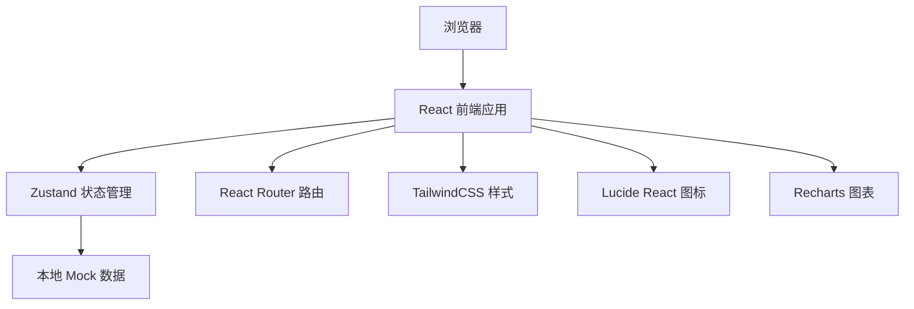
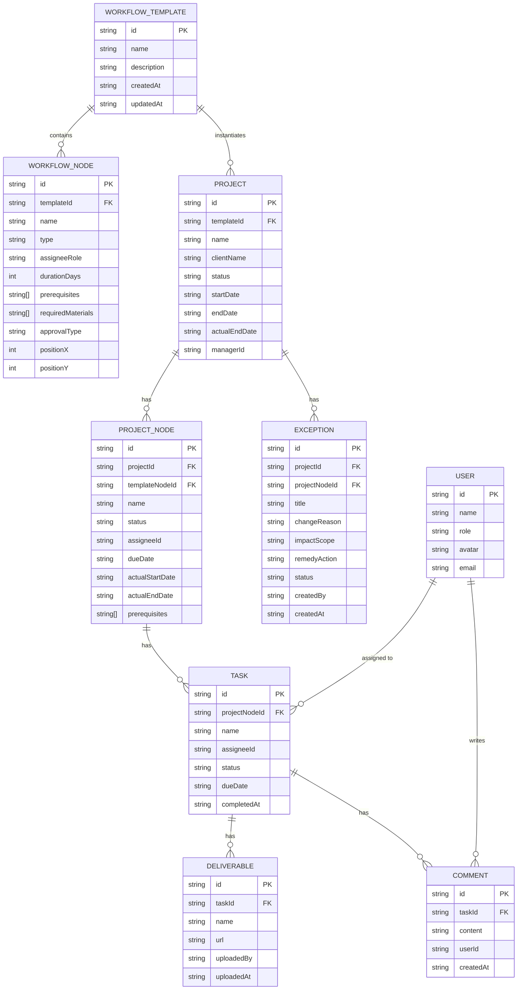

## 1. 架构设计



## 2. 技术描述

- **前端**：React@18 + TypeScript + Vite
- **状态管理**：Zustand
- **路由**：React Router DOM@6
- **样式**：TailwindCSS@3
- **图标**：Lucide React
- **图表**：Recharts
- **后端**：无后端，使用本地 Mock 数据 + LocalStorage 持久化
- **数据库**：LocalStorage 存储应用数据

## 3. 路由定义

| 路由路径 | 页面用途 |
|---------|---------|
| `/templates` | 流程模板列表页 |
| `/templates/new` | 新建流程模板（流程设计器） |
| `/templates/:id/edit` | 编辑流程模板 |
| `/projects` | 执行中心 - 项目列表 |
| `/projects/:id` | 项目详情页 |
| `/tasks` | 任务中心 - 我的任务 |
| `/tasks/:id` | 任务详情页 |
| `/exceptions` | 异常处理列表 |
| `/exceptions/new` | 新增异常记录 |
| `/reports` | 报表统计页 |

## 4. 数据模型

### 4.1 数据模型 ER 图



### 4.2 数据类型定义

```typescript
// 节点类型
type NodeType = 'quotation' | 'contract' | 'material' | 'venue' | 'rehearsal' | 'settlement' | 'custom';

// 审批方式
type ApprovalType = 'none' | 'manager' | 'admin' | 'multi_level';

// 状态类型
type Status = 'pending' | 'in_progress' | 'completed' | 'delayed' | 'rejected';

// 角色类型
type UserRole = 'admin' | 'manager' | 'executor';

// 流程模板
interface WorkflowTemplate {
  id: string;
  name: string;
  description: string;
  nodes: WorkflowNode[];
  createdAt: string;
  updatedAt: string;
}

// 流程节点（模板中的节点定义）
interface WorkflowNode {
  id: string;
  templateId: string;
  name: string;
  type: NodeType;
  assigneeRole: UserRole;
  durationDays: number;
  prerequisites: string[]; // 前置节点ID
  requiredMaterials: string[]; // 必填材料
  approvalType: ApprovalType;
  positionX: number;
  positionY: number;
}

// 项目
interface Project {
  id: string;
  templateId: string;
  name: string;
  clientName: string;
  status: Status;
  startDate: string;
  endDate: string;
  actualEndDate?: string;
  managerId: string;
  nodes: ProjectNode[];
}

// 项目节点（实际项目中的节点实例）
interface ProjectNode {
  id: string;
  projectId: string;
  templateNodeId: string;
  name: string;
  type: NodeType;
  status: Status;
  assigneeId: string;
  dueDate: string;
  actualStartDate?: string;
  actualEndDate?: string;
  prerequisites: string[];
  deliverables: Deliverable[];
  comments: Comment[];
}

// 交付物
interface Deliverable {
  id: string;
  projectNodeId: string;
  name: string;
  url: string;
  uploadedBy: string;
  uploadedAt: string;
}

// 评论/留言
interface Comment {
  id: string;
  projectNodeId: string;
  content: string;
  userId: string;
  createdAt: string;
}

// 异常记录
interface Exception {
  id: string;
  projectId: string;
  projectNodeId?: string;
  title: string;
  changeReason: string;
  impactScope: string;
  remedyAction: string;
  status: 'open' | 'in_progress' | 'resolved';
  createdBy: string;
  createdAt: string;
}

// 用户
interface User {
  id: string;
  name: string;
  role: UserRole;
  avatar: string;
  email: string;
}
```

## 5. 项目目录结构

```
src/
├── components/          # 通用组件
│   ├── Layout/         # 布局组件
│   ├── Sidebar/        # 侧边栏
│   ├── Navbar/         # 顶部导航
│   ├── Card/           # 卡片组件
│   ├── Button/         # 按钮组件
│   ├── Modal/          # 弹窗组件
│   ├── StatusBadge/    # 状态标签
│   └── EmptyState/     # 空状态
├── pages/              # 页面组件
│   ├── Templates/      # 流程模板
│   ├── Designer/       # 流程设计器
│   ├── Projects/       # 执行中心
│   ├── Tasks/          # 任务中心
│   ├── Exceptions/     # 异常处理
│   └── Reports/        # 报表统计
├── store/              # Zustand 状态管理
│   ├── useTemplateStore.ts
│   ├── useProjectStore.ts
│   ├── useTaskStore.ts
│   ├── useExceptionStore.ts
│   └── useUserStore.ts
├── types/              # TypeScript 类型定义
│   └── index.ts
├── data/               # Mock 数据
│   └── mockData.ts
├── utils/              # 工具函数
│   ├── date.ts
│   ├── id.ts
│   └── status.ts
├── App.tsx
├── main.tsx
└── index.css
```
